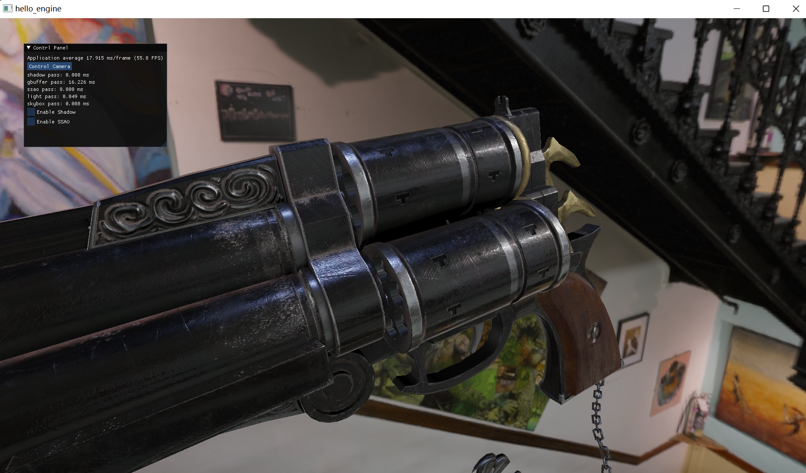
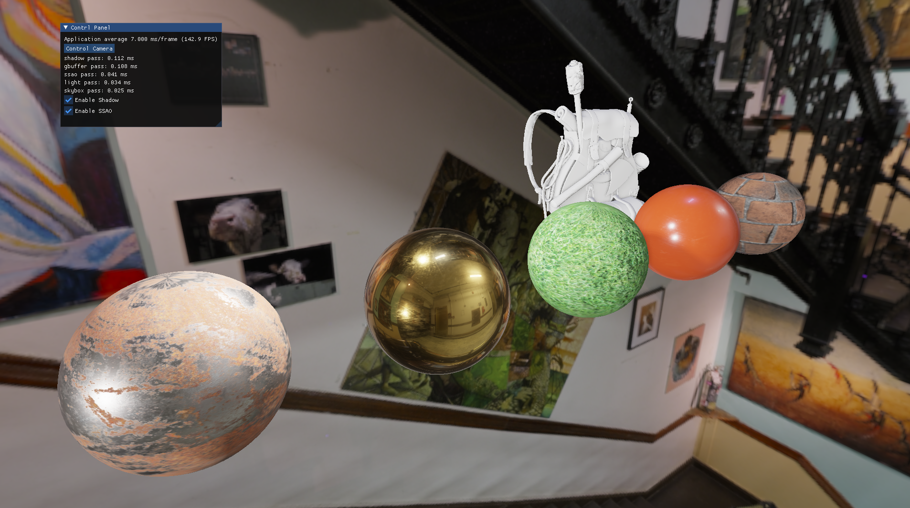
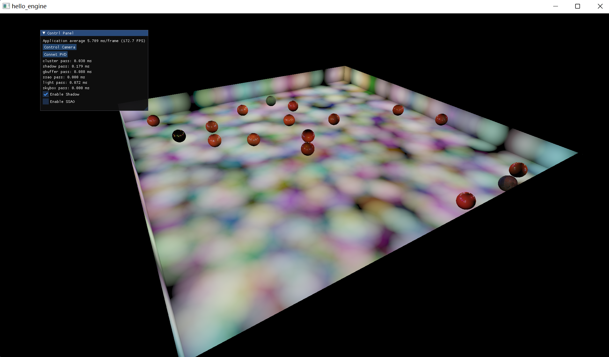
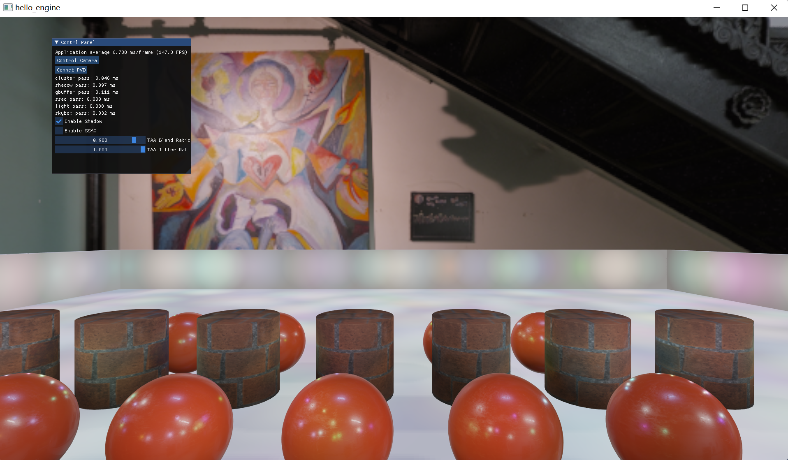
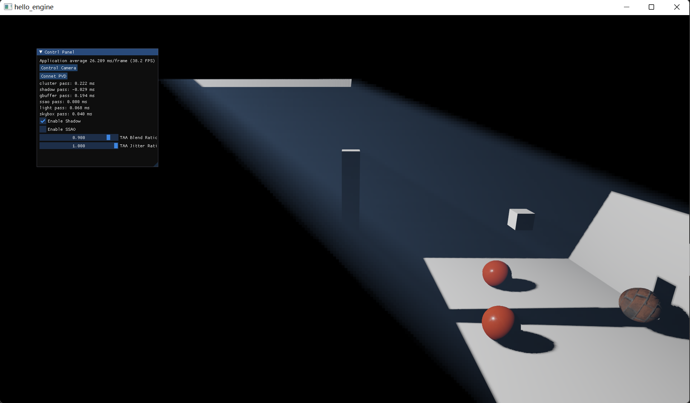

# engine

## Feature

- Render Pipeline

	cluster deferred lighting, PBR, TAA, shadow, SSAO, 

- Gameplay

	ECS Framework

- Script Binding

	cpython with cxx binding interface

- Physics

	powered by NVIDIA Physx

## Screenshot










## Dependency

### MSVC on Windows

network to access github

### gcc/clang on Linux or Mingw

- glfw
- glm
- assimp

## Run (tested on RX 470, Polaris 10, GCN 4)


``` bash
# clone
git clone https://github.com/Hithy/engine.git
cd engine

# compile
cmake -Bbuild -DASSIMP_BUILD_TESTS=off
cmake --build build --config RelWithDebInfo

# run
cmake --build build --config RelWithDebInfo --target run
```

## Play

ref to [scene.py](script/ecs/scene.py)

